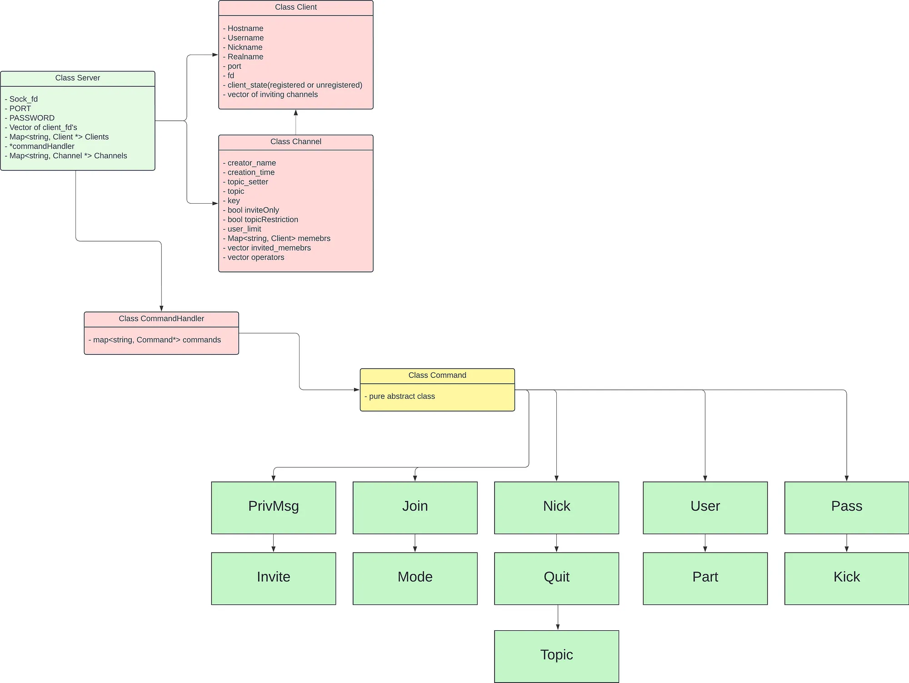
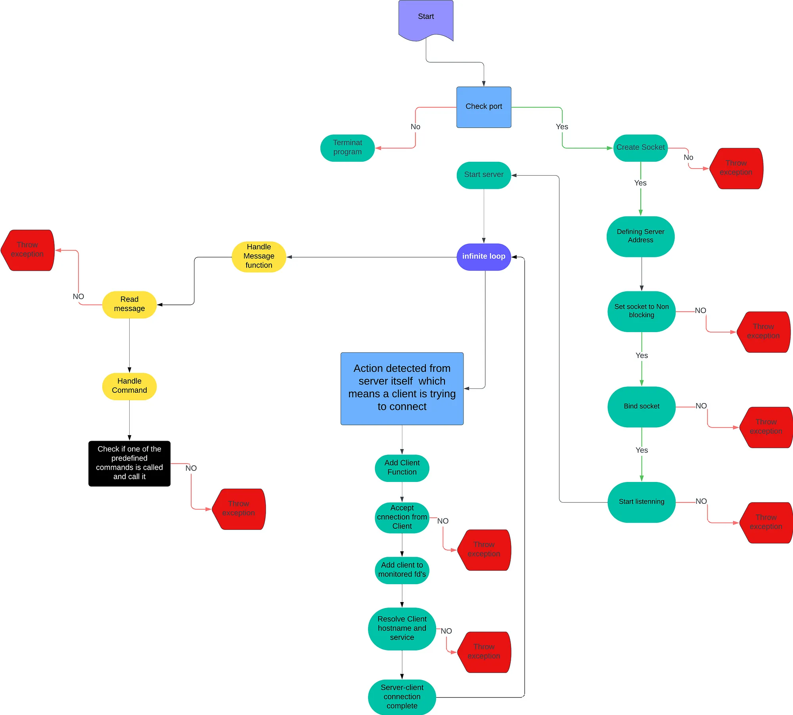

```
 ██╗  ██████╗    ██████╗
 ██║  ██╔══██╗  ██╔════╝
 ██║  ██████╔╝  ██║
 ██║  ██╔══██╗  ██║
 ██║  ██║  ██║  ╚██████╗
 ╚═╝  ╚═╝  ╚═╝   ╚═════╝
    Internet Relay Chat
```

*Create your own IRC server in C++, fully compatible with an official client.*

 Skills | Grade |
:------:|:-----:|
[**Network & system administration**] [**Object-oriented programming**] [**Unix**] [**Rigor**] | *Subscribed* |
<!-- **:white_check_mark: 100%** -->

* **[Mandatory part](#mandatory-part)**
* **[Study resources](#study-resources)**

<details>
  <summary><b>Workflow</b></summary>

1. Fazer um servidor

*Estrutura do projeto:*


*Diagrama do Algoritimo:*


</details>

<details>
  <summary><b>See</b></summary>

- <cstring> (c++) vs <string.h> (c)
- **Boost libraries** (are forbidden).
- file type *.ipp
- optional configuration file
- relacao e uso de: select(), kqueue() ou epoll().
- Use o **wireshark**/um **proxy** personalizado etc. para inspecionar a\
  comunicação entre seu servidor de referência (ou seu servidor) e você, seu cliente
- [Project reference](https://github.com/RIDWANE-EL-FILALI/FT_IRC)

</details>

## Mandatory part
<details>
  <summary><b>External functs.</b></summary>

*Essas funções são todas utilizadas para manipulação de sockets e operações\
de entrada/saída no ambiente Unix, com compatibilidade com C++ 98.*

Funcoes externas | Header | Brief
------- | ------ | -----
**socket**        | `<sys/socket.h>` | Cria um ponto de comunicação, usado para comunicação de rede.        
**close**         | `<unistd.h>`     | Fecha um descritor de arquivo, incluindo sockets.                    
**setsockopt**    | `<sys/socket.h>` | Configura opções de um socket, como tempo de espera ou buffer.       
**getsockname**   | `<sys/socket.h>` | Recupera o endereço associado a um socket.                          
**getprotobyname**| `<netdb.h>`      | Recupera informações sobre protocolos a partir de um nome.           
**gethostbyname** | `<netdb.h>`      | Recupera o endereço IP de um host dado o nome de domínio.            
**getaddrinfo**   | `<netdb.h>`      | Resolve hostnames para endereços IP, substituto moderno de `gethostbyname`.
**freeaddrinfo**  | `<netdb.h>`      | Libera a estrutura alocada pela função `getaddrinfo`.                
**bind**          | `<sys/socket.h>` | Associa um endereço ao socket.                                       
**connect**       | `<sys/socket.h>` | Conecta um socket a um endereço remoto.                              
**listen**        | `<sys/socket.h>` | Marca um socket para aceitar conexões de entrada.                    
**accept**        | `<sys/socket.h>` | Aceita uma conexão de entrada em um socket.                          
**htons**         | `<arpa/inet.h>`  | Converte números de porta de host para rede em ordem de bytes.       
**htonl**         | `<arpa/inet.h>`  | Converte um inteiro de 32 bits de host para rede em ordem de bytes.  
**ntohs**         | `<arpa/inet.h>`  | Converte números de porta de rede para host em ordem de bytes.       
**ntohl**         | `<arpa/inet.h>`  | Converte um inteiro de 32 bits de rede para host em ordem de bytes.  
**inet_addr**     | `<arpa/inet.h>`  | Converte um endereço IP no formato string para um valor numérico.    
**inet_ntoa**     | `<arpa/inet.h>`  | Converte um valor numérico de IP para uma string legível.            
**send**          | `<sys/socket.h>` | Envia dados através de um socket.                                    
**recv**          | `<sys/socket.h>` | Recebe dados de um socket.                                           
**signal**        | `<signal.h>`     | Configura manipuladores de sinais de sistema.                        
**sigaction**     | `<signal.h>`     | Define ações personalizadas para sinais.                             
**lseek**         | `<unistd.h>`     | Move o ponteiro de leitura/escrita de um arquivo para uma nova posição.
**fstat**         | `<sys/stat.h>`   | Obtém informações sobre um arquivo aberto.                           
**fcntl**         | `<fcntl.h>`      | Manipula descritores de arquivos, como bloquear ou configurar flags. 
**poll**          | `<poll.h>`       | Monitora múltiplos descritores de arquivo para verificar eventos.

</details>

<details>
  <summary><b>IRC server in C++ 98.</b></summary>

- Você não deve desenvolver um cliente. 
- Você não deve lidar com a comunicação de servidor para servidor.
- `./ircserv <port> <password>`
  - **port:** O número da porta na qual seu servidor IRC estará ouvindo as conexões de IRC de entrada.
  - **password:** A senha da conexão. Será necessário para qualquer cliente de IRC que tente se conectar ao seu servidor.

</details>

<details>
  <summary><b>Requirements</b></summary>

- O servidor deve ser capaz de lidar com vários clientes ao mesmo tempo e nunca travar. 
- Forking não é permitido. Todas as operações de I/O devem **não bloquear**.
- Apenas 1 poll() (ou equivalente) pode ser usado para lidar com todas essas operações\
(ler, escrever, mas também ouvir e assim por diante).

> [!NOTE]
> *Como você precisa usar descritores de arquivo sem bloqueio, é possível usar funções de read/recv ou write/send sem poll()\
(ou equivalente), e seu servidor não estaria bloqueando. Mas consumiria mais recursos do sistema.\
Assim, se você tentar read/recv ou write/send em qualquer descritor de arquivo sem usar poll() (ou equivalente), sua nota será 0.*

- Existem vários clientes de IRC. Você tem que escolher um deles como **referência**.\
Seu cliente de referência será usado durante o processo de avaliação. 
- Seu cliente de referência deve ser capaz de se conectar ao seu servidor sem encontrar nenhum erro. 
- A comunicação entre cliente e servidor deve ser feita via TCP/IP (v4 ou v6). 
- Usar seu cliente de referência com seu servidor deve ser semelhante a usá-lo com qualquer servidor IRC oficial.\
No entanto, você só precisa implementar os seguintes recursos: 
  - Você deve ser capaz de autenticar, definir um apelido, um nome de usuário, ingressar em um canal,\
  enviar e receber mensagens privadas usando seu cliente de referência. 
  - Todas as mensagens enviadas de um cliente para um canal precisam ser encaminhadas para todos os\
  outros clientes que se juntaram ao canal. 
  - Você deve ter operadores e usuários regulares. 
  - Então, você tem que implementar os comandos que são específicos para os **operadores de canal**: 
    - KICK - Ejetar um cliente do canal
    - INVITE - Convidar um cliente para um canal 
    - TOPIC - Alterar ou visualizar o canal 
    - MODE - Alterar o modo do canal: 
      - i: Definir/remover o canal somente para convite 
      - t: Definir/remover as restrições dos operadores topo o comando TOPIC para canal 
      - k: Definir/remover a chave do canal (senha) 
      - o: Dar/retirar privilégio do operador de canal
      - l: Defina/remova o limite do usuário para o canal 
- Claro, espera-se que você escreva um código limpo.

</details>

<details>
  <summary><b>For MacOS only</b></summary>

*Como o MacOS não implementa write() da mesma maneira que outros sistemas operacionais Unix,\
você tem permissão para usar fcntl(). Você deve usar descritores de arquivo no modo sem bloqueio\
para obter um comportamento semelhante ao de outros sistemas operacionais Unix.*

*No entanto, você tem permissão para usar fcntl() apenas da seguinte forma:\
`fcntl(fd, F_SETFL, O_NONBLOCK);` Qualquer outro sinalizador é proibido.*

</details>

<details>
  <summary><b>Test Example</b></summary>

- Verifique absolutamente todos os erros e problemas possíveis (receber dados parciais,\
baixa largura de banda e assim por diante). 
- Para garantir que seu servidor processe corretamente\
tudo o que você envia para ele, o seguinte teste simples usando **nc** pode ser feito:
```bash
\$> nc 127.0.0.1 6667
com^Dman^Dd
\$>
```
- Use **ctrl+D** para enviar o comando em várias partes: `'com'`, depois `'man'` e depois `'d\n'`. 
- Para processar um comando, você deve primeiro agregar os pacotes recebidos para reconstruí-lo.

</details>

## Study resources
Article / Forum | Tutorial | Video | Documentation
:------:|:--------:|:-----:|:-------------:
[irc - wikipedia](https://en.wikipedia.org/wiki/IRC) | [ircgod](https://ircgod.com/) | [Creating TCP server](https://youtu.be/cNdlrbZSkyQ?si=jF6gYPAGYGEJVr_v) | [RFC1459](https://datatracker.ietf.org/doc/html/rfc1459)
[ircdocs](https://ircdocs.horse/) | [ft_irc guide](https://reactive.so/post/42-a-comprehensive-guide-to-ft_irc/) | [User guide IRC](https://youtu.be/ZA9NoLiIHCI?si=dSsAll3lBZSLPgP2) | [RFC2812](https://datatracker.ietf.org/doc/html/rfc2812)
[Using Internet Sockets](https://beej.us/guide/bgnet/html/split-wide/index.html) | [irc - broly](https://medium.com/@ridwaneelfilali/internet-relay-chat-da58a0e4d2ba) |   | [More links](https://stackoverflow.com/questions/24310/programming-a-simple-irc-internet-relay-chat-client)
[IRC specifications](https://ircdocs.horse/specs/) | [Network - broly](https://medium.com/@ridwaneelfilali/c-network-programming-5d89bd32cbb2) |
[Modern IRC](https://modern.ircdocs.horse/) | [irc -Talha Demir](https://medium.com/@talhadmr/ft-irc-server-92ffcd1d4338) |
[ircv3](https://ircv3.net/) | [irc - afatir](https://medium.com/@afatir.ahmedfatir/small-irc-server-ft-irc-42-network-7cee848de6f9) |